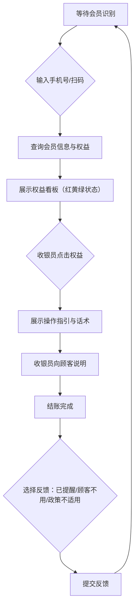

## 1. 产品概述

药店收银台医保个账权益提醒窗口——嵌在日常收银流程旁的轻量辅助工具，不改变收银员原有开票习惯。会员报手机号或刷会员码后，窗口自动展示该会员的医保个账相关权益，并以红/黄/绿三色直观区分可用、即将过期、暂不可用状态，帮助收银员一句话传达操作要点，结账后一键反馈提醒结果，方便门店店长复盘服务质量。

- 目标用户：药店收银员（主要操作者）、门店店长（复盘查看者）、购药顾客（权益受益者）
- 核心价值：减少权益遗漏、规范话术沟通、留存服务反馈数据

## 2. 核心功能

### 2.1 用户角色

| 角色 | 使用方式 | 核心权限 |
|------|----------|----------|
| 收银员 | 工号登录 | 查询会员权益、查看操作指引、使用标准话术、提交反馈 |
| 店长 | 管理账号登录 | 查看全部功能 + 查看反馈统计报表 |

### 2.2 功能模块

1. **会员识别页**：手机号输入 / 会员码扫描入口
2. **权益看板页**：权益卡片列表，红黄绿三色状态，点击展开详情
3. **操作指引与话术页**：一句话操作指引 + 标准话术卡片
4. **反馈提交页**：已提醒 / 顾客不用 / 政策不适用 三选一反馈

### 2.3 页面详情

| 页面名称 | 模块名称 | 功能描述 |
|----------|----------|----------|
| 会员识别页 | 手机号输入框 | 输入11位手机号，回车触发查询 |
| 会员识别页 | 会员码扫描区 | 模拟扫码枪输入，自动识别会员码 |
| 会员识别页 | 会员基本信息 | 查询成功后显示姓名、会员等级、医保类型 |
| 权益看板页 | 权益状态卡片 | 每条权益显示名称、状态色标（绿=可用/黄=即将过期/红=暂不可用）、到期日 |
| 权益看板页 | 权益筛选标签 | 按状态筛选：全部 / 可用 / 即将过期 / 暂不可用 |
| 权益看板页 | 权益计数徽章 | 各状态数量汇总 |
| 操作指引页 | 一句话指引 | 哪些商品可参与、是否需会员确认、结算时提醒事项 |
| 操作指引页 | 标准话术卡片 | 顾客犹豫时的规范话术，可点击复制 |
| 反馈提交页 | 反馈选项 | 已提醒 / 顾客不用 / 政策不适用 三选一 |
| 反馈提交页 | 备注输入 | 可选填备注说明 |
| 反馈提交页 | 提交确认 | 提交后自动回到会员识别页 |

## 3. 核心流程

收银员在正常收银过程中，顾客提供手机号或刷会员码 → 系统自动查询会员医保个账权益 → 窗口以红黄绿三色展示权益列表 → 收银员点击某条权益查看操作指引和话术 → 向顾客说明 → 结账后选择反馈结果 → 提交后窗口重置等待下一位会员。

## 4. 用户界面设计

### 4.1 设计风格

- **主色调**：医疗蓝 (#1B6EF3) + 温暖白 (#F8FAFC)，传递专业信任感
- **辅助色**：状态绿 (#16A34A)、状态黄 (#EAB308)、状态红 (#DC2626)
- **按钮风格**：圆角（8px），主按钮实心填充，辅助按钮描边
- **字体**：标题使用思源黑体/Noto Sans SC Bold，正文使用系统字体
- **布局风格**：侧边栏窗口形态，紧凑卡片式布局，适配收银台小屏（1024×768）
- **图标风格**：Lucide 线性图标，简洁专业

### 4.2 页面设计概览

| 页面名称 | 模块名称 | UI 元素 |
|----------|----------|----------|
| 会员识别页 | 手机号输入区 | 居中大输入框，数字键盘样式，蓝色边框聚焦态 |
| 会员识别页 | 扫码区域 | 虚线框扫码占位，扫描动画反馈 |
| 会员识别页 | 会员信息卡 | 白色圆角卡片，头像+姓名+会员等级+医保类型标签 |
| 权益看板页 | 筛选标签栏 | 横向标签组，选中态蓝色填充，带计数徽章 |
| 权益看板页 | 权益卡片 | 左侧色条标识状态，右侧箭头可展开，悬停阴影提升 |
| 操作指引页 | 指引条目 | 图标+文字列表，关键信息加粗高亮 |
| 操作指引页 | 话术气泡 | 蓝色背景圆角气泡，右侧复制按钮 |
| 反馈提交页 | 反馈按钮组 | 三个等宽大按钮，分别绿/黄/灰色调，选中态描边加粗 |
| 反馈提交页 | 备注输入 | 单行文本输入框，占位提示文字 |

### 4.3 响应式策略

- 桌面端优先，目标分辨率 1024×768（收银台常见分辨率）
- 窗口设计为固定宽度侧边面板（约 400px），适配与 POS 系统并排显示
- 最小支持 768px 宽度

### 4.4 动效设计

- 会员查询：加载脉冲动画
- 权益卡片：展开/收起使用滑动过渡（200ms ease）
- 状态标签：淡入动画，交错延迟（50ms stagger）
- 反馈提交：按钮点击缩放反馈 + 提交成功勾选动画
- 页面切换：向左滑入过渡
