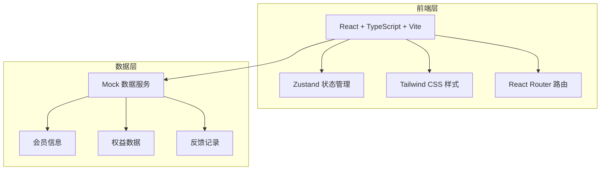
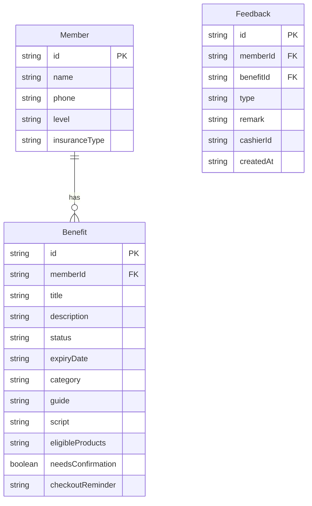

## 1. 架构设计



## 2. 技术说明

- 前端：React@18 + TypeScript + Tailwind CSS@3 + Vite
- 初始化工具：vite-init（react-ts 模板）
- 后端：无（纯前端 + Mock 数据）
- 数据库：无（使用内存 Mock 数据，localStorage 持久化反馈记录）
- 状态管理：Zustand
- 路由：React Router DOM v6
- 图标：lucide-react

## 3. 路由定义

| 路由 | 用途 |
|------|------|
| / | 会员识别页（手机号/扫码输入） |
| /benefits | 权益看板页（红黄绿状态卡片列表） |
| /benefit/:id | 权益详情页（操作指引+话术） |
| /feedback | 反馈提交页（已提醒/顾客不用/政策不适用） |

## 4. 数据模型

### 4.1 数据模型定义



### 4.2 数据定义

**会员（Member）类型**：
- id: string — 会员唯一标识
- name: string — 会员姓名
- phone: string — 手机号
- level: string — 会员等级（普通/银卡/金卡）
- insuranceType: string — 医保类型（职工医保/居民医保）

**权益（Benefit）类型**：
- id: string — 权益唯一标识
- memberId: string — 所属会员ID
- title: string — 权益名称
- description: string — 权益描述
- status: 'available' | 'expiring' | 'unavailable' — 可用/即将过期/暂不可用
- expiryDate: string — 到期日期
- category: string — 权益分类（礼包/慢病/家庭共享/其他）
- guide: string — 一句话操作指引
- script: string — 标准话术
- eligibleProducts: string — 可参与商品说明
- needsConfirmation: boolean — 是否需要会员确认
- checkoutReminder: string — 结算时提醒事项

**反馈（Feedback）类型**：
- id: string — 反馈唯一标识
- memberId: string — 会员ID
- benefitId: string — 权益ID
- type: 'reminded' | 'declined' | 'inapplicable' — 已提醒/顾客不用/政策不适用
- remark: string — 备注说明
- cashierId: string — 收银员ID
- createdAt: string — 创建时间

## 5. 项目目录结构

```
src/
├── components/
│   ├── MemberSearch.tsx       # 会员识别组件
│   ├── MemberInfo.tsx         # 会员信息卡片
│   ├── BenefitCard.tsx        # 权益状态卡片
│   ├── BenefitList.tsx        # 权益列表（含筛选）
│   ├── BenefitDetail.tsx      # 权益详情（操作指引+话术）
│   ├── FeedbackForm.tsx       # 反馈提交表单
│   ├── StatusBadge.tsx        # 状态徽章组件
│   └── ScriptBubble.tsx       # 话术气泡组件
├── pages/
│   ├── IdentifyPage.tsx       # 会员识别页
│   ├── BenefitsPage.tsx       # 权益看板页
│   ├── DetailPage.tsx         # 权益详情页
│   └── FeedbackPage.tsx       # 反馈提交页
├── store/
│   └── useAppStore.ts         # Zustand 全局状态
├── data/
│   └── mockData.ts            # Mock 数据
├── types/
│   └── index.ts               # TypeScript 类型定义
├── App.tsx
└── main.tsx
```
